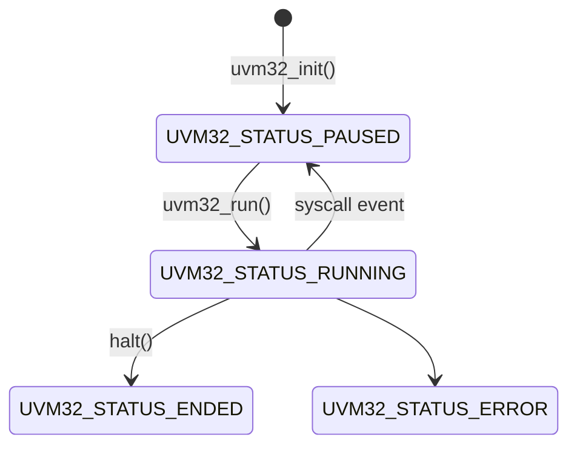

# 🌱 uvm32

uvm32 is a minimalist, dependency-free virtual machine sandbox designed for microcontrollers and other resource-constrained devices. Single C file, no dynamic memory allocations, asynchronous design, pure C99.

On an [STM32L0](https://www.st.com/en/microcontrollers-microprocessors/stm32l0-series.html) (ARM Cortex-M0+) the required footprint is under 4KB flash/1KB RAM.

## What is it for?

* As a no-frills alternative to embedded script engines ([Lua](https://www.lua.org/), [Duktape](https://duktape.org/), [MicroPython](https://micropython.org/), etc)
* As a [sandbox](https://en.wikipedia.org/wiki/Write_once,_run_anywhere) to isolate untrusted or unreliable elements of a system
* As a way to allow development in modern systems programming languages where a compiler for the target may not be available ([rust-hello](apps/rust-hello))
* As a way to [write once, run anywhere](https://en.wikipedia.org/wiki/Write_once,_run_anywhere) and avoid maintaining multiple software variants

## Features

* Bytecode example apps written in C, Zig, Rust and assembly
* Non-blocking design, preventing misbehaving bytecode from stalling the host
* No assumptions about host IO capabilities (no stdio)
* Simple, opinionated execution model
* Safe minimally typed FFI
* Small enough for "if this then that" scripts/plugins, capable enough for [much more](apps/zigdoom)
* Aims for safety over speed, bad code running in the VM should never be able to crash the host

Although based on a [fully fledged CPU emulator](https://github.com/cnlohr/mini-rv32ima), uvm32 is intended for executing custom script like logic, not for simulating hardware.

## Understanding this repo

uvm32 is a tiny virtual machine, all of the code is in [uvm32](uvm32).

A minimal example of a host to run code in is at [host-mini](hosts/host-mini).

Everything else is a more advanced host, or a sample application which could be run.

## Example

A simple VM host from [host-mini](hosts/host-mini)

```c
#include <stdio.h>
#include <string.h>
#include <stdlib.h>
#include "uvm32.h"
#include "../common/uvm32_common_custom.h"

uint8_t rom[] = { // mandel.bin
  0x23, 0x26, 0x11, 0x00, 0xef, 0x00, 0xc0, 0x00, 0xb7, 0x08, 0x00, 0x01,
  ...
  ...
};

int main(int argc, char *argv[]) {
    uvm32_state_t vmst;
    uvm32_evt_t evt;
    bool isrunning = true;

    uvm32_init(&vmst);
    uvm32_load(&vmst, rom, sizeof(rom));

    while(isrunning) {
        uvm32_run(&vmst, &evt, 100);   // num instructions before vm considered hung

        switch(evt.typ) {
            case UVM32_EVT_END:
                isrunning = false;
            break;
            case UVM32_EVT_SYSCALL:    // vm has paused to handle UVM32_SYSCALL
                switch(evt.data.syscall.code) {
                    case UVM32_SYSCALL_PUTC:
                        printf("%c", uvm32_getval(&vmst, &evt, ARG0));
                    break;
                    case UVM32_SYSCALL_PRINTLN: {
                        const char *str = uvm32_getcstr(&vmst, &evt, ARG0);
                        printf("%s\n", str);
                    } break;
                    case UVM32_SYSCALL_YIELD:
                    break;
                    default:
                        printf("Unhandled syscall 0x%08x\n", evt.data.syscall.code);
                    break;
                }
            break;
            case UVM32_EVT_ERR:
                printf("UVM32_EVT_ERR '%s' (%d)\n", evt.data.err.errstr, (int)evt.data.err.errcode);
            break;
            default:
            break;
        }
    }

    return 0;
}
```

## Samples

 * [host](hosts/host) vm host which loads a binary and runs to completion, handling multiple syscall types
 * [host-mini](hosts/host-mini) minimal vm host (shown above), with baked in bytecode
 * [host-parallel](hosts/host-parallel) parallel vm host running multiple vm instances concurrently, with baked in bytecode
 * [host-arduino](hosts/host-arduino) vm host as Arduino sketch (`make test` to run AVR code in qemu)
 * [apps/helloworld](apps/helloworld) C hello world program
 * [apps/conio](apps/conio) C console IO demo
 * [apps/lissajous](apps/lissajous) C console lissajous curve (showing softfp, floating point)
 * [apps/maze](apps/maze) C ASCII art recursive maze generation
 * [apps/hello-asm](apps/hello-asm) Minimal hello world assembly
 * [apps/fib](apps/fib) C fibonacci series program (iterative and recursive)
 * [apps/self](apps/self) host-mini with embedded mandelbrot generation program, compiled as an app (inception!)
 * [apps/sketch](apps/sketch) C Arduino/Wiring/Processing type program in `setup()` and `loop()` style
 * [apps/rust-hello](apps/rust-hello) Rust hello world program (note, the version of rust installed by brew on mac has issues, use the official rust installer from https://rust-lang.org/learn/get-started/)
 * [apps/zig-mandel](apps/zig-mandel) Zig ASCII mandelbrot generator program
 * [apps/zigtris](apps/zigtris) Zig Tetris (https://github.com/ringtailsoftware/zigtris)
 * [apps/zigalloc](apps/zigalloc) Demonstration of using extram with zig allocator
 * [apps/heap](apps/heap) Demonstration of `malloc()` on extram in C
 * [apps/zigdoom](apps/zigdoom) Port of PureDOOM (making use of Zig to provide an allocator and libc like functions)

## Quickstart (docker)

    make dockerbuild
    make dockershell

Then, from inside the docker shell

    make

    ./hosts/host/host apps/helloworld/helloworld.bin

`host` is the command line test VM for running samples. Run `host -h` for a full list of options.

## Native build

The example VM hosts should all build with any C compiler. To build all of the examples in `apps`, you will need a RISC-V cross compiler, Zig 0.15.2 and Rust (stable). To build the example `host-arduino` you will need `arduino-cli`.

On mac

    brew install arduino-cli riscv64-elf-gcc riscv64-elf-binutils sdl3

    cd hosts/host-sdl
    make
    cd apps/zigdoom
    make test


## Quickstart API

```c
uint8_t bytecode[] = { /* ... */ }; // some compiled bytecode
uvm32_state_t vmst; // execution state of the vm
uvm32_evt_t evt; // events passed from vm to host

uvm32_init(&vmst); // setup vm
uvm32_load(&vmst, bytecode, sizeof(bytecode)); // load the bytecode
uvm32_run(&vmst, &evt, 100); // run up to 100 instructions

switch(evt.typ) {
	// check why the vm stopped executing
}
```

## Operation

Once loaded with bytecode, uvm32's state is advanced by calling `uvm32_run()`.

	uint32_t uvm32_run(uvm32_state_t *vmst, uvm32_evt_t *evt, uint32_t instr_meter)
	
`uvm32_run()` will execute until the bytecode requests some IO activity from the host.
These IO activities are called "syscalls" and are the only way for bytecode to communicate with the host.
If the bytecode attempts to execute more instructions than the the passed value of `instr_meter` it is assumed to have crashed and an error is reported.

(As with a watchdog on an embedded system, the `yield()` bytecode function tells the host that the code requires more time to complete and has not hung)

`uvm32_run()` always returns an event. There are four possible events:

* `UVM32_EVT_END` the program has ended
* `UVM32_EVT_ERR` the program has encountered an error
* `UVM32_EVT_SYSCALL` the program requests some IO via the host

## Internals

uvm32 emulates a RISC-V 32bit CPU using [mini-rv32ima](https://github.com/cnlohr/mini-rv32ima). All IO from vm bytecode to the host is performed using `ecall` syscalls. Each syscall provided by the host requires a unique syscall value. A syscall passes two values and receives one on return.

uvm32 is always in one of 4 states, paused, running, ended or error.



## Boot

At boot, the whole memory is zeroed. The user program is placed at the start. The stack pointer is set to the end of memory and grows downwards. No heap region is setup and all code is in RAM.

## ExtRAM

A single block of external RAM may be memory mapped into the VM at any time using:

    uvm32_extram(uvm32_state_t *vmst, uint32_t *ram, uint32_t len)

The `ram` region must be 32bit aligned, as all accesses will be 32bit words. The `len` is given in bytes.

From inside the VM, the memory is available from address `0x10000000`

    uint32_t *p = (uint32_t *)UVM32_EXTRAM_BASE;
    p[0] = 0xDEADBEEF;

When the external RAM is written to by the VM, the dirty flag will be set. The flag is automatically cleared on the next call to `uvm32_run()`. The flag can be checked using:

    bool uvm32_extramDirty(uvm32_state_t *vmst)

## syscall ABI

All communication between bytecode and the vm host is performed via syscalls.

To make a syscall, register `a7` is set with the syscall number (a `UVM32_SYSCALL_x`) and `a0`, `a1` are set with the syscall parameters. The response is returned in `a2`.

[target.h](common/uvm32_target.h#L12)

```c
static uint32_t syscall(uint32_t id, uint32_t param1, uint32_t param2) {
    register uint32_t a0 asm("a0") = (uint32_t)(param1);
    register uint32_t a1 asm("a1") = (uint32_t)(param2);
    register uint32_t a2 asm("a2");
    register uint32_t a7 asm("a7") = (uint32_t)(id);

    asm volatile (
        "ecall"
        : "=r"(a2) // output
        : "r"(a7), "r"(a0), "r"(a1) // input
        : "memory"
    );
    return a2;
}
```
The [RISC-V SBI](https://github.com/riscv-non-isa/riscv-sbi-doc/blob/master/riscv-sbi.adoc) is not followed, a simpler approach is taken.

## syscalls

There are two inbuilt syscalls used by uvm32, `halt()` and `yield()`.

`halt()` tells the host that the program has ended normally. `yield()` tells the host that the program requires more instructions to be executed. Halt is handled internally and transitions the VM to `UVM32_STATUS_ENDED`, `yield()` is handled in the VM host like other syscalls. 

Syscalls are handled in the host by reading the syscall identifier, then using the provided functions to get arguments and set a return response. Direct access to the VM's memory space is not allowed, to avoid memory corruption issues.

The following functions are used to access syscall parameters safely: 

    uint32_t uvm32_getval(uvm32_state_t *vmst, uvm32_evt_t *evt, uvm32_arg_t);
    const char *uvm32_getcstr(uvm32_state_t *vmst, uvm32_evt_t *evt, uvm32_arg_t);
    void uvm32_setval(uvm32_state_t *vmst, uvm32_evt_t *evt, uvm32_arg_t, uint32_t val);
    uvm32_evt_syscall_buf_t uvm32_getbuf(uvm32_state_t *vmst, uvm32_evt_t *evt, uvm32_arg_t argPtr, uvm32_arg_t argLen);

## Event driven operation

A useful pattern for code running in the VM is to be event-driven. In this setup the program requests blocks until woken up with a reason. This requires some support in the host, but can be implemented as follows.

In the VM code:

```c
while(1) {
    // ask host to suspend running until one of the following events
    uint32_t wakeReason = yield(KEYPRESS_EVENT_MASK | MOUSE_EVENT_MASK | NETWORK_EVENT_MASK);
    switch(wakeReason) {
        ...
    }
}
```

In the host code:

```c
uvm32_run(&vmst, &evt, 1000);
switch(evt.typ) {
    case UVM32_EVT_SYSCALL:
        switch(evt.data.syscall.code) {
            case UVM32_SYSCALL_YIELD:
                uint32_t events = uvm32_getval(&vmst, &evt, ARG0);
                // do not call uvm32_run() again until something in the events set is triggered
            break;
            ...
        }
    break;
    ...
}
```

Then, to wake the VM once an (eg. key) event has occurred

```c
uvm32_setval(&vmst, &evt, RET, KEYPRESS_EVENT_MASK);
uvm32_run(&vmst, &evt, 1000);
```

## Configuration

The uvm32 memory size is set at compile time with `-DUVM32_MEMORY_SIZE=X` (in bytes). A memory of 512 bytes will be sufficient for trivial programs.

## Debugging

Binaries can be disassembled with

    riscv64-elf-objdump -d -f hello-asm.elf
    riscv64-elf-objdump -S -d -b binary -m riscv:rv32 -D -M no-aliases -f hello-asm.bin

## License

This project is licensed under the MIT License. Feel free to use in research, products and embedded devices.
